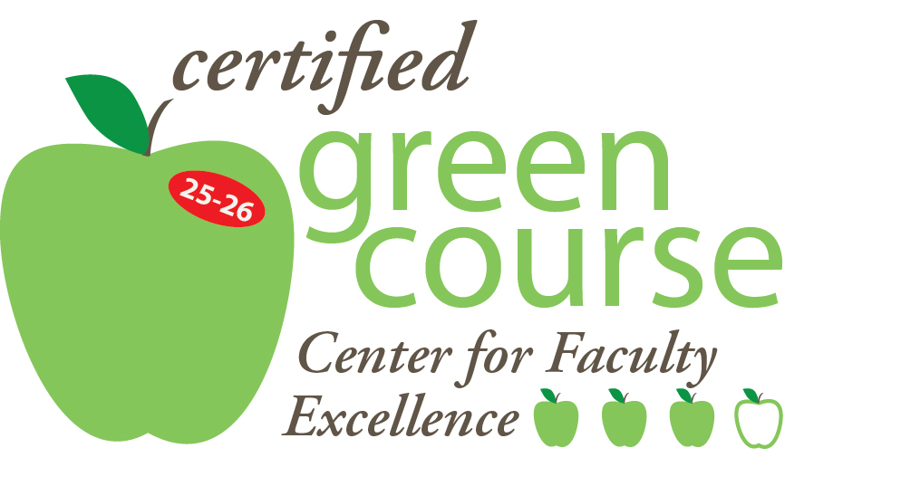

# Course Information

**Title:** DATA 413/613 *Data Science*

**Instructor:** My Name, my_email\@american.edu {width="30" fig-align="right" style="border-radius: 50%"}

**Teaching Assistant:** TA Name, email: ta\@american.edu

**Classes:**

This course is in-person as scheduled. Students are expected to attend class each week.

-   Section 003: Thursdays: 5:30 to 8:00 PM at DMTI 119 or if needed my_zoom_link.

**Office Hours:** Request an Appointment by Email or Chat

# Course Overview {width="86"}

## Purpose

Develop students as members of a data science professional community able to strategize about and solve diverse, complex problems in an efficient and reproducible manner by applying in-depth and broad knowledge of modern statistical programming capabilities, methods, and tools.

## Description

Classes cover multiple data science methods focused on collecting, organizing, and analyzing data to build models and communicate analytical results in a reproducible manner.

-   You will use R packages to acquire, clean, and tidy data from a variety of online sources; develop shiny applications; build statistical models and analyses, and present/communicate findings.
-   You will use Git and GitHub for version control of individual and group work and collaboration.
-   You will collaborate with a small group to design and develop a new Shiny application for others to use to analyze data from an online source of your choice.

This course assumes recent experience and competency with the material covered in DATA-412/612: i.e., the use of tidyverse packages {ggplot2}, {dplyr}, {tidyr}, {stringr}, {readr}, {forcats}, and {lubridate}, the use of Quarto with R Markdown, and operating in the RStudio Integrated Development Environment (IDE). It also assumes some knowledge of statistical analysis in R. \## Learning Outcomes

## Learning Outcomes

Upon successful completion of this course, you will be able to demonstrate competence in developing solutions requiring diverse data science methods for large and messy data.

Specific learning outcomes are:

::: table-striped
| Course | Learning Outcome |
|------|-----------------------------------------------------|
| 413-613 | Design and implement advanced statistical programming solutions using the R Programming Language (with Tidyverse and other packages), the RStudio Desktop IDE, and Quarto/R Markdown to create efficient reproducible analysis involving large, real-world, data sets to solve problems. |
| 413-613 | Apply statistical programming capabilities for using application programming interfaces, web-scraping, and/or SQL to gather large data sets efficiently and securely. |
| 413-613 | Use Tidyverse methods to efficiently manipulate and analyze large data sets. |
| 413-613 | Create on-line solutions for generating data, enabling distributed interactive numerical and graphical analysis, and/or communicating results by developing an app, a website, and/or a dashboard. |
| 413-613 | Analyze textual data using basic Natural Language Processing concepts and methods. |
| 413-613 | Evaluate Data Science scenarios for potential ethical issues across the data science life cycle and identify possible mitigation strategies. |
| 413-613 | Understand multiple ways to engage with the professional Data Science community. |
| 613 | Use statistical programming capabilities to enable others to interactively create explanatory and predictive models, test hypotheses, analyze assumptions, and interpret the results as part of a group-developed deployed, interactive analysis product. |
| 413-613 | Use a version control system (Git) and a Git-centric, cloud-based collaboration environment (Git Hub) to enable distributed management of analysis and support collaboration on products. |
|413-613|Use Artificial Intelligence (AI) and Large language Models (LLMs) effectively and responsibly via interactive chat, code-based interfaces, and as coding assistants or agents.|
:::

## Prerequisites

This course requires successful completion of DATA-612 as a prerequisite. It is assumed graduate students in this course have an intermediate knowledge of statistical methods.

## Required Resources

The most current set of lecture notes are online at [Lecture Notes for AU DATA 413-613 Data Science](https://audatascience-data-413-613.share.connect.posit.cloud/){target="_blank"}.

### Textbook

All recommended references are free and available online at the links below:

-   [R for Data Science - Second Edition](https://r4ds.hadley.nz/){target="_blank"} by Wickham and Grolemund
-   [Advanced R](https://adv-r.hadley.nz/) {target="_blank"}-- Wickham (O'Reilly)
-   [Mastering Shiny](https://mastering-shiny.org/){target="_blank"} - Wickham
-   [Text Mining with R](https://www.tidytextmining.com/){target="_blank"} -- Silge & Robinson
-   Posit [Cheat Sheets](https://www.posit.co/resources/cheatsheets/){target="_blank"}
-   [The tidyverse Style Guide](https://style.tidyverse.org/){target="_blank"} by Hadley Wickham

### Related References

- [Creating a Data Science Computing Environment](https://audatascience-ds-comp-env.share.connect.posit.cloud/){target={_blank"}}
-   [Quarto Guide](https://quarto.org/docs/guide/){target="_blank"} 
- [RStudio Guide](https://docs.posit.co/ide/user/){target="_blank"} 
- [Positron Guide](https://positron.posit.co/welcome.html){target="_blank"} 
-   *Help files and vignettes for multiple packages used in the courses*

### Computing Environment

-   You will need a computing device capable of running R and RStudio or Positron on the device or in the cloud.
-   You will need to be able to access and interact with American University's Canvas Learning Management System
-   You will need access to reliable internet capable of supporting Zoom video sessions for Office Hours while using AU's Zoom license.

### Software Requirements

For installation and update instructions see Appendices [A](https://rressler.quarto.pub/data-413-613/zapp_install_languages_quarto_ides.html) and [B](https://rressler.quarto.pub/data-413-613/zapp_git_github_setup.html) of the lecture notes. 

- These refer to a consolidated book [Creating a Data Science Computing Environment](https://audatascience-ds-comp-env.share.connect.posit.cloud/)

You will need to install/update and configure the following:

- R, Python, SQL
- RStudio or Positron
- Git and GitHub
  

# Schedule of Topics

The following is a general sequence of topics over the 15 weeks of the course.

-   A week is considered to start on Sunday and end the following Saturday.

::: table-striped
| Week |  | Topics | Group Project |
|:--:|-|-----------------------|:-----------:|
| 1 |  | Git and GitHub |  |
| 2 |  | Responsible Data Science and Tidyverse Review |  |
| 3 |  | Vectors, Lists, For Loops, and purrr |  |
| 4 |  | Writing and Debugging Functions |  |
| 5 |  | Getting Data: Open Data, APIs | Teams Due |
| 6 |  | Getting Data: Web Scraping and Rectangling |  |
| 7 |  | Databases and SQL |  |
| 8 |  | GItHub Team Workflow and Shiny Basics: UI and Server Functions, |  |
| 9 | | Shiny Advanced: Reactivity,Layouts, and Customization | Project Plan Due |
| 10 | | Mapping with R | Peer Review Due |
| 11 | | Text Analysis 1: Sentiment Analysis | Progress Report Due |
| 12 |  | Text Analysis 2: TF-IDF and Group Project Collaboration | In Class Collaboration |
| 13 | | Environments and R in Production |  |
| 14 || Working with AI and LLMs |  |
| 15 |  | Group Project Presentations | App Repos with Vignettes Due |
:::

# Overall Structure

-   We will use Canvas as our Learning Management System for the course.
-   We will meet each week in person in the designated classroom (or on Zoom per AU guidelines).
-   Each Week is a Canvas Module and the first item in the Module is a Page that describes the week to include the general topics, the applicable lecture note sections, the focus of the quiz, weekly assignment, group discussion topic, and the pre-work.
    -   The pre-work is not graded but it is designed to better prepare you for the class. It may consist of reviewing lecture notes, watching videos for an overview of the topic, or, installing software needed for the class.
-   The typical class will include a short quiz on the previous week's material, discussions of concepts and methods, as well as exercises and demonstrations of methods and tools in R, SQL, or Python.
-   Lecture Notes are posted online on a public site and will be updated throughout the course. The notes cover concepts, methods, practical examples and have many references. They also include material on topics not covered in this course.
-   I will generally create a Quarto .qmd file or other code during class and that additional material will generally be posted on GitHub in the *Class Lectures* repository by the next day after class.
-   This is an in-person class. I will use Zoom to record portions of each lecture. Zoom recordings will be available on Canvas Media Gallery within a day or two after class.

# Graded Elements

There are five graded elements for the course: Attendance and Engagement, Quizzes, Weekly Assignments, Weekly Group Discussions, and the deliverables for the Group Project.

-   No exams are currently scheduled. However, they may be added if they could boost student learning.
-   The group project demonstrations will be delivered during the final exam class period.

## Attendance and Engagement:

Attendance will be taken each class. All students are expected to engage during class. This includes asking questions, answering questions from the instructor or other students, and offering your own insights or recommendations. Students should be ready to share their solutions to individual or group exercises or labs when called upon during class.

## Quizzes

Weeks 2 through 14 will have a short (10-minute) quiz on the previous week's material as discussed during the class, presented in the lecture notes, or used on the assignment.

-   These will be Canvas quizzes to be done online using your computer.
-   All questions are designed to be automatically scored.
-   Scores and answers will be released the day after the last class each week.
-   You may use the lecture notes, your own notes, R, and RStudio/Positron during the quiz. Very few questions will need live coding. You may do so if you wish but it will not become part of the quiz.
-   You may **Not** use co-pilots, large language models, generative AI, or other internet resources on the quizzes.

## Weekly Assignments

Expect assignments each week with total points based on the length and complexity. There may be extra credit problems.

-   The Canvas instructions for each weekly assignment will include a link to the GitHub Classroom assignment. You must click on the link to create your own GitHub repository for the assignment.
-   Once you have completed the each Weekly Assignment, you must ensure the code and all documents are up to date on GitHub and then submit a comment on Canvas that the assignment is complete and ready for scoring.
-   Assignments are due the following week. I will accept late homework assignments but there may be a scoring penalty.
-   The General Assignment Instructions posted on Canvas Module 1 apply to all assignments. hey are also in the lecture notes under [Appendix D General Instructions for Weekly Assignments](https://rressler.quarto.pub/data-413-613/zapp_general_instructions_for_assignments.html). Failure to follow the general instructions will result in point deductions.
-   Each assignment will include specific instructions and a rubric.
    -   Assignments will usually come with a starter .qmd file with the questions and an HTML file with the specific instructions and rubric. *Ensure you look at both to understand what is required of the solution, especially sample plots.*
-   **The default status for all questions is you are not permitted to use copilots, LLM, Generative AI tools, and the like to generate your code for the solutions  or your responses to questions, e.g., interpretations of tests or code.** 
- However, some assignment questions will explicitly allow the use of these tools for select aspects of the question.
    -   When you are permitted to use an AI tool, cite the tool or tools you used, describe your strategy for the solution, provide your first prompt to the tool, and then explain how you determined the solution was both correct and appropriate in accordance with the instructions. 
    - **You must be able to explain the logic and syntax of all code you submit.**
-   **I will not provide solutions to assignments.** However, I will discuss some assignments in class. I will also provide comments when grading to indicate a path to a solution. 
- I am happy to meet with you during office hours to discuss assignments before they have been submitted or after they have been graded.

### Grading the Assignments

-   Many of the problems could be solved in multiple ways but the instructions and scoring typically mandate using the capabilities taught in DATA 412-612 and this course.
- The rubrics define the required elements and point values.
  - Almost every plot or statistical test question requires you to interpret the plot or test. Don't forget that element as it is often more important for your learning that the code creating the plot.
-   Partial credit will be awarded for solutions that demonstrate partial mastery of the appropriate concepts from this course.
-   Extra credit may be awarded for innovative solutions.
-   Egregious errors or bad practices will result in deductions.

### Questions on Assignments

-   **If you have any doubts about what a question is asking of you, collaborate with your peers and/or ask me for clarification.** There may be unintentional errors or imprecise questions in the assignments.
-   Review the assignments within 24 hours and request office hours well before the due date when there is more flexibility.
-   The assignments are designed to be challenging but not frustrating. **Do not spend hours scouring the internet on one part of a question.**
  -   If you have spent 30 minutes on a question and don't see the path forward, **push your work to GitHub and e-mail me a question! I will try to respond quickly so you can get on with your work.**
- Most assignment problems have multiple parts that build on each other. Try to use the logic of the entire problem to help you interpret the question and validate your results.
-   **If you would like office hours, please email me and suggest some times. Be sure to push your latest work to GitHub before we meet.**

## Weekly Group Discussions

Weeks 1 through 13 will have a group discussion using Canvas. The discussions increase your exposure to topics about responsible data science , data science capabilities, or your understanding of the data science community and your professional development. There are a variety of sources to expose you to perhaps new sources of information about the profession.

You will be required to watch a video, review a document, or some other activity and then post a comment about it on the group discussion. Once you post it you get extra credit for a substantive comment on up to two other people's comments.

## Group Project

All students will prepare a group project (3-4 people) using tools from the course.

-   You will **self-organize** into groups with each other based on common interests.

There are multiple deliverables associated with the final project:

-   Group and Topic Identification
-   Project Plan
-   Peer Review of Project Plan
-   Progress Report
-   Shiny App
-   Vignette for the shiny app, and
-   Group Demonstration of the Shiny App to the class based on the vignette.
    -   Scoring for the demonstration will include peer feedback.
-   You will also complete a Peer Review of Group Collaboration

The shiny app is required to be useful for others to explore and analyze a data set. This is not about *your group's analysis* of the data, but about *how you enable others to do an analysis* using your app.

-   **Students in 413 will create a Shiny App for data analysis.**

-   **Students in DATA 613 will create a Shiny App for both data analysis and interactive statistical modeling**.

The project requires working with a recent (latest data no earlier than 2023) fairly large, real-world dataset from an online original source (not Kaggle or the like) to enable analysis of questions on a topic of interest to the group.

-   The analysis must be reproducible on my machine and include graphical representations of your data analysis and models.

**Each person must commit their own code and/or text to the group GitHub repository** using the group's GitHub workflow approach. GitHub shows exactly who committed which lines of code/text and when.

-   If you show no or few commits, with no or few lines, or just at the end of the project, that would suggest you did not contribute to the project in a meaningful way which may result in large scoring deductions for you.
-   The group's vignette must include a section or appendix that shows the primary contributors for the major sections of the project.
-   There will be extra credit on the first homework for people who identify the rock band famous for not wanting brown M&M candies at the top of their assignment.
-   **Your individual score will reflect my assessment of your level of contribution and learning based on all elements of the Group Project to include the Peer Review of Group Collaboration. It may be higher, lower, or the same as others in your group.**

# Final Grades

## Weighting of Elements

::: table-striped
| Element | Weight | Description |
|----------|----:|----------------------------------------|
| Attendance and Engagement | 5% | Engagement during class discussions that helps achievement of learning outcomes. |
| Quizzes | 15% | Weekly Quizzes |
| Weekly Assignments | 45% | Weekly problem sets which are due the following week. |
| Group Discussions | 5% | Completion of Group Discussions activities and meaningful comments |
| Group Project | 30% | Students form groups, pick a topic and data set, and complete the deliverables. |
| Mini-Projects |  | Mini-projects may be assigned to help students demonstrate competencies in one or more course learning outcomes |
:::

## Converting Scores to Final Grades

Final grades are based on the weighted average of the graded elements rounded to the closest integer with an emphasis on how students demonstrate the course learning outcomes by the end of the course.

::: table-striped
| Range %     | Letter |
|-------------|:------:|
| 93 or above |   A    |
| 90-92       |   A-   |
| 87-89       |   B+   |
| 83-86       |   B    |
| 80-82       |   B-   |
| 77-79       |   C+   |
| 70-76       |   C    |
| 67 - 69     |   C-   |
| 60-66       |   D    |
| 59 or less  |   F    |
:::

# Administrative Information

## Contacting Me

Canvas Chat and Inbox allow us to engage with each other outside of class time.

-   If Canvas Chat says I am online (outside of when I teach), feel free to say Hi, ask a question, or request a meeting.

-   Use Inbox to send me (or other students) direct messages (emails) at any time. I will try to respond within 24 hours. The threads will be conveniently saved in your Canvas Inbox where you can search and filter.

-   The [Canvas Conversations Tutorial](https://community.canvaslms.com/t5/Video-Guide/Inbox-Overview-All-Users/ta-p/383696) or [Canvas Guide](https://community.canvaslms.com/docs/DOC-10574-4212710325) have more information.

-   If you send me a regular email to my AU account, it *must be from an AU email account*. I will try to respond within 24 hours. I will not respond to emails from non-AU email addresses since your identify cannot be assured.

## Office Hours

**All office hours are online using Zoom by appointment.** I have a lot of flexibility for when we can meet to accommodate your schedule.

-   I will set up a Zoom meeting with a unique link where you can share your video and your desktop or RStudio application. Please ensure all content on your computer or background is safe for sharing with me prior to sharing.
-   I will also send you a support request so I can control your computer remotely *during the Zoom session* only. You can choose to adjust your privacy settings for Zoom to allow me to do so, or choose not to.

To schedule some time, send me a chat/canvas message or AU email and suggest some times.

- I will be generally available afternoons other than when I teach but can be flexible to accommodate your schedules.

Office Hours are not just about content or assignments. Feel free to request some time to discuss a topic of interest even if it is not about an assignment.

## Shared Expectations for this Course

### Students are expected to:

-   **Be familiar with Canvas.** We will be using Canvas for all course work. There are many different resources to help you learn how to use Canvas. If you have questions, ask!
-   **Be familiar with Zoom and able to join via SSO using your American University email.**
-   **Engage** with me and your peers. We will be having discussions and group activities so interact with peers to facilitate shared learning.
-   **Review assignments early, ask questions, and submit assignments by the deadline.**
-   **Respond to all individual emails from me** to confirm receipt.
-   **Be Proactive** on potential issues. The sooner I am aware of an issue affecting your ability to participate in the course or complete an assignment the more time we have to develop a solution that works for both of us.

### I shall:

-   **Be dedicated to making this an interesting and effective course for you.**
-   **Be available and flexible** in response to student questions, requests for office hours, or just discussions.
-   **Accept all feedback and suggestions** with thanks. If things are unclear, appear to be mistakes, or don't work as expected, please let me know as soon as you think something is amiss or could be better.
-   **Communicate any changes in Assignments or Classes** as soon as possible.
-   **Try to respond to emails within 24 hours during the work week;**
-   **Try to grade assignments within 21 days of the assignment deadline**.

# Assistance with Class Content or Assignments

I am generally available for office hours and for email inquiries about class content or assignments. There are many other resources as well.

## Teaching Assistant

We are fortunate to have a Teaching Assistant who can assist you with specific questions about the course content and assignments.

-   Given their other duties, the TA has limited hours per week so support is on a first-come-first-served basis.
-   Please connect with the TA via Canvas or email. If you cannot connect in time, feel free to email me with questions.

## The RStudio IDE, Posit, and Quarto Websites

The RStudio IDE provides an online help system with immediate access to help on any R function. Many R packages have detailed vignettes to help understand how to use the functions to accomplish a task.

-   See the RStudio IDE Help Menu for access to **R Help, Cheat Sheets, the RStudio Community Forum, Key Board Shortcuts, and Quick References**.

Most R packages have a website with additional documentation about the functions or vignettes.

The [Quarto Guide](https://quarto.org/docs/guide/) site has number of documents on specific functionality with examples.

## Searching for Help Online

You can use online resources as a guide to understanding a question or how to implement your solution, but you must actually implement it yourself.

Using these resources is expected. However, **DO NOT just copy and paste blocks of code into your work**.

**All work you submit is expected to be your own**.

-   You do not need to cite use of these resources for insights or getting the proper syntax for your solution.
-   If you have to copy the code to get your work to complete, cite the source, and explain what the code is doing in your comments.

Some of the available resources include:

-   Search Engines such as Google.
-   YouTube or other videos.
-   Help sites or blogs.
-   The vibrant community of R users (who often eager to assist) such as at [Posit Community](https://community.rstudio.com/).
-   [StackOverflow](https://stackoverflow.com/), a general purpose site for many computing languages and questions.
    -   Be sure to check the dates of the questions. If the answers are more than two years old, they not may be accurate or helpful.

Students *are permitted to use generative AI tools*, such as ChatGPT or meta.ai on all assignments and assessments to **improve understanding of the problem. You may only use for coding or solutions where explicitly indicated in the assignment question.**

-   Using these tools responsibly means **acknowledging, through appropriate citation**, for example, where and how they've been used. **Include the prompts as part of your citation.**
    -   See [How to cite ChatGPT](https://apastyle.apa.org/blog/how-to-cite-chatgpt).
-   **Caution:** LLMs like ChatGPT and meta.ai are not perfect and will often "hallucinate" instead of telling you they don't know the answer. *Students are responsible for assessing the accuracy and value of the output of any generative AI tools, and are accountable for all work they submit.*
-   Students are responsible for recognizing the limitations of these tools, and are accountable for AI-generated work that produces invented data or sources.
-   Improper usage may constitute violations of the University’s Academic Integrity Code.
-   Note that representing the outputs of these models as original work usually also violates the terms of service for the tools.

**You are not permitted to use software tools or generative AI tools to create your original writing.**

Students *are permitted to use software tools* or generative AI to review and revise the organization, content, and syntax of your writing.

-   This includes the use of spell checkers, grammar checkers, thesauruses built included with applications such as MS Word or Google Docs.
-   This also includes standalone tools such as Grammerly, WordTune, Virtual Writing Tutor, or SlickWrite.
    -   If you use a standalone tool or generative AI tool cite its use at the end of the document but you do not have to cite the individual revisions.

## AU's Quantitative Support for Students

[Quantitative Support](https://www.american.edu/provost/academic-access/quantitative.cfm) provides free mathematics and statistics support to students.

[Math and Stat Statistical Software Support](https://www.american.edu/provost/academic-access/mathstat.cfm) tutors will assist students enrolled in data science courses, via online one-on-one settings, in using and interpreting results from software such as Excel, Python, R, Stata, SPSS, SQL, SAS, and StatCrunch.

-   All appointments are scheduled and managed through [WC Online](https://american.mywconline.net/).

## The AU Writing Center

The [Writing Center](https://www.american.edu/provost/eagle-learning-center/writing-center/index.cfm) offers free, peer-based writing support for enrolled students.

-   Writing consultants meet with you in 45-minutes sessions where they provide insight and feedback to improve the work at hand as well as strengthen your writing and editing abilities.
-   All appointments are scheduled and managed through [WC Online](https://american.mywconline.net/). This platform also hosts the online sessions.

## AU Academic Coaching

The [Academic Coaching](https://www.american.edu/provost/academic-access/academic-success-coaching.cfm) matches coaches and students in 30-minute sessions. Learners identify and enhance academic strategies. Sessions are interactive and learners can expect to leave with a strategic action plan.

-   Virtual Sessions are held via Microsoft Teams, Monday - Friday.

-   Sign up via [YouCanBookMe](https://auacademiccoaching.youcanbook.me/).

# Academic Integrity and Collaboration

I am required to report cases of academic dishonesty to the Dean of the College of Arts and Sciences.

Read American University's [Academic Integrity Code](http://www.american.edu/academics/integrity/code.cfm) carefully, especially Section II, A.

Data Science is usually done by Teams where collaboration enables progress towards a shared outcome. In this course, the outcomes are individual, other than designated group assignments. That means **all work on individual assignments must be your own.**

Students *are encouraged to collaborate with each other on understanding a problem or a method or technique*.

However, **students are not permitted to share their work or solutions on an individual assignment.**

-   Do not share your writing, code files, or snippets with each other.
-   Do not share your screens with each other.
-   Do not let others type on your computer, including tutors.

**It is also prohibited to provide, share, distribute request, borrow, review, purchase or otherwise use solutions to homework assignments, papers, projects, quizzes, or exams, from other American University instances of this course, i.e., other sections, or, previous versions of the course.**

-   You should be able to explain any code you write in terms of how it works, and why it generates its results. If you cannot explain your code, then you are not demonstrating progress towards achieving the learning outcomes.
-   You should be able to explain your writing in terms of how the references and logic flow to achieve your findings and recommendations.
-   If you cannot explain your work, you are not demonstrating progress towards achieving the learning outcomes.

**If you have any concerns or questions at any time, please ask me.**

# Course Policies and Resources

## Class Attendance

Demonstrating the learning outcomes of this course depends upon regular attendance in class. Students should attend every class meeting.

Per American University’s Undergraduate Regulations:

> “Excused absences include major religious holidays (posted annually by the Office of the Provost and Kay Spiritual Life Center or verified by the Kay Spiritual Life Center as an excused absence for religious observance), medical or mental health events, approved disability-accommodation-related absences, and approved varsity athletic team events.”

If possible, students seeking an excuse should communicate with me in a timely manner and supply proper documentation where applicable.

**Please avoid coming to class if you are feeling ill.** Let me know and you can join via Zoom if you are up to it.

-   Please email to let me know you will miss (or missed) class due to illness and request an excused absence. You will have access to class notes and videos and have time to make up work missed during health-related absences.
-   You do not need to submit, nor can I accept, any medical, mental health, or other documentation.
-   If you are experiencing a significant or lengthy personal or medical event that may affect academic progress or result in prolonged absences, work directly with the Office of the Dean of Students.
-   In these cases, the Office of the Dean of Students will communicate with me and your advisor.
-   See the Dean of Students webpage: [Temporary Medical Leave of Absence](https://www.american.edu/student-affairs/dos/leave-guide.cfm) for more details.

All other absences are considered unexcused. More than three unexcused absences may be grounds for course failure.

If you have special circumstances (e.g., a prohibitive time zone, family obligations, technological access issues) that prevent regular attendance at synchronous class meetings, consult with me to devise a plan for meeting the course requirements and learning outcomes.

Excessive absences, excused or unexcused, can change the nature of the course so that it is impossible for you to achieve the learning outcomes. In these cases, consult with me and your advisor about options, including withdrawal, medical leave, or course failure.

## Religious Observances

Students are required to check the course syllabus at the beginning of the semester and make any conflicts with religious observances known to me and propose arrangements for missed classes or assignments.

Students will be provided the opportunity to make up any examination, study, or work requirements that may be missed due to a religious observance, provided they notify me before the end of the second week of classes.

Email me your notification with the course-section and request type in the subject and a proposal for covering the material.

For additional information, see American University’s [Major Holy Days of Observance](https://www.american.edu/student-affairs/kay/major-religious-holy-days.cfm).

## Respect for Diversity

I am committed to using your name and pronouns. Please help me pronounce your name correctly, each time.

Class rosters and University data systems are provided to faculty with the student's legal name and gender marker.

We will take time during our first session to do introductions. You can share with all members of our class your name and pronouns, as you are comfortable.

-   If these change during the semester, please let me know and we can develop a plan to share this information in a way that is safe for you.

-   Should you want to update your name with the university, please look at the guidelines under the Student Affairs [Trans Resource Guide](https://www.american.edu/ocl/cdi/TRG.cfm).

## Academic Support and Access Center (ASAC) Services

A wide range of services is available to support you in your efforts to meet the course requirements.

All students may take advantage of the Academic Support and Access Center (ASAC) for individual academic skills counseling, workshops, Tutoring and Writing Lab appointments, peer tutor referrals, and Supplemental Instruction.

-   To register with a disability or for questions about disability accommodations, contact the Academic Support and Access Center at 202-885-3360 or asac\@american.edu (mailto: asac\@american.edu)
-   See [Disability-Related Accommodations](https://www.american.edu/provost/academic-access/accommodations.cfm) for more information.
-   A more complete list of campus-wide resources is available in the ASAC.

If you have any special needs that require accommodations, let me know during the first week of class.

-   Provide a letter from the Academic Support and Access Center.
-   Accommodations are not retroactive, so timely notification is strongly recommended.

## Use of Student Work

I may use academic work you complete in this course for educational purposes. Your registration and continued enrollment constitute your consent.

## Recording Policies

Faculty may record classroom lectures or discussions for pedagogical use, future student reference, or to meet the accommodation needs of students with a documented disability.

**Students are not permitted to make visual or audio recordings, including live streaming, of classroom lectures or any class related content, using any type of recording devices** (e.g., smart phone, computer, digital recorder, etc.) unless prior permission from the instructor and all students in the class.

-   Exceptions will be made for students who present a signed Letter of Accommodation from the Academic Support and Access Center.
-   If permission is granted, personal use and sharing of recordings and any electronic copies of course materials (e.g., digital handouts, formulas, lecture notes and any classroom discussions online or otherwise) is limited to the personal use of students registered in the course and for educational purposes only, and may not be distributed, shared, sold, or posted on social media outlets without the written permission of faculty, **even after the end of the course.**

Unauthorized downloading, file sharing, distribution of any part of a recorded lecture or course materials, solutions, or using information for purposes other than the student's own learning may be deemed a violation of American University's [Student Conduct Code](https://www.american.edu/policies/students/student-conduct-code.cfm) and subject to disciplinary action (see Student Conduct Code VI. Prohibited Conduct).

## Well Being Resources

[The Center for Well-Being Programs and Psychological Services](https://www.american.edu/ocl/counseling/) is available to all AU students, whether you're full-time or part-time, undergraduate or graduate. Services are always free and confidential.

## Defining and Reporting Discrimination and Harassment (Title IX).

American University expressly prohibits any form of discrimination and discriminatory harassment and operates in compliance with applicable laws and regulations. As a faculty member, I am required to report discriminatory or harassing conduct to the university if I witness it or become aware of it -- regardless of the location of the incident.

There are four confidential resources on campus if you wish to speak to someone who is not required to report: the Counseling Center, Victim advocates in OASIS, medical providers in the Student Health Center, and ordained clergy in the Kay Spiritual Life Center.

If you experience any of the above, you have the option of filing a report with [University Police](http://www.american.edu/finance/publicsafety/index.cfm) , the Office of the [Dean of Students](http://www.american.edu/ocl/dos/) , or the [Title IX Office](http://www.american.edu/ocl/TitleIX/index.cfm) .

For more information, including a list of supportive resources on and off-campus, contact OASIS (oasis\@american.edu or 202-885-7070) or check out the Support Guide on the Title IX [Find Supporet webpage](https://www.american.edu/ocl/TitleIX/support.cfm).

-   [AU's Plan for Inclusive Excellence](https://www.american.edu/president/diversity/inclusive-excellence/)

# Use of Zoom Video Conference Capabilities

Zoom is the default mode for all office hours. If you want me to be able to type on your computer using remote support, you may need to adjust your privacy settings to allow Zoom to enable my access.

-   Please ensure your screen content is appropriate for sharing before sharing your screen.

## Zoom Recordings

I will be recording most of each class session using Zoom.

-   The recordings will generally be available the day after class.
-   I will usually announce when I start and when I stop recording. During recording you may ask questions at any time, but they will be recorded.
-   If we are using Zoom for class I will also ask students to share their screens during activities which may be recorded.
-   I also encourage questions before the recordings start and after they stop as well in case you have a question but don't want to be recorded.

## Signing In

To authenticate you are an authorized user **sign into Zoom through the SSO capability and AU domain using your \@american.edu email address** (Not your \@student.american.edu address).

-   If you are on a computer, recommend using the Zoom app and not the web browser.
-   Using the App allows you to select **sign in with SSO** and then enter **american** for the domain.
-   Using a browser you must go through american.zoom.us to sign in.
-   Do not use Google, Facebook or personal accounts, even if created with your student.american.edu email address.
-   Use the Zoom Test Meeting Room (https://zoom.us/test) to test your connection.

## Using the Camera

I will keep my camera on during class. If you are on Zoom, I encourage you to turn your camera on when you are speaking, but you do not have to do so.

-   If you choose to use your camera, please check your background to ensure it is appropriate for sharing with others.

## Using the Microphone

Please keep your microphone on mute unless you are speaking.

-   If you forget, I will probably mute it for you to reduce background noise and potential audio feedback.
-   You can un-mute to ask a question at any time or "raise your hand".

## Other Features

**Chat Pane**: I normally have the attendee pane open, not the chat pane. Feel free to chat with each other but if you want me to see something, please say something, or raise your hand.

**Presenter Privileges**: All students will have presenter privileges. This means you can share your screen with the group.

**Breakout Rooms**: Zoom allows me to create breakout rooms where the class is divided into groups, each in their "own room" for collaboration.

## Zoom Video Conference References

The links below provide access to Zoom student tutorials to learn about the tool, how to access your meeting room, and share your screen.

-   [Zoom Test Meeting Room](https://zoom.us/test). Use this link to access the Zoom Test Meeting Room to test out the software before joining an actual session.
-   [Download Zoom](https://zoom.us/support/download).
-   [Log in to Zoom Through Desktop Application](https://american.zoom.us/)
-   [Enable and Test Audio & Webcam](https://support.zoom.us/hc/en-us/articles/201362283-How-Do-I-Join-or-Test-My-Computer-Audio-).
-   [Schedule a meeting](https://support.zoom.us/hc/en-us/articles/201362413-How-Do-I-Schedule-Meetings-) or [Join a Zoom meeting.](https://support.zoom.us/hc/en-us/articles/201362193-How-Do-I-Join-A-Meeting-).
-   [Invite others to join meeting](https://support.zoom.us/hc/en-us/articles/201362183).
-   [Chat (Professors) - Students look at attendees section for instructions](https://support.zoom.us/hc/en-us/articles/205761999-Webinar-Chat).
-   [Share My Screen](https://support.zoom.us/hc/en-us/articles/201362153-How-Do-I-Share-My-Screen-).
-   [Record a Local Zoom meeting](https://support.zoom.us/hc/en-us/articles/201362473-How-do-I-record-a-meeting-).
-   [Host Control in Meetings](https://support.zoom.us/hc/en-us/articles/201362603-Who-Is-The-Host-Of-The-Meeting-).
-   [Getting Started with iOS](https://support.zoom.us/hc/en-us/articles/201362993-Getting-Started-with-iOS).
-   [Getting Started with Android](https://support.zoom.us/hc/en-us/articles/200942759-Getting-Started-with-Android).
